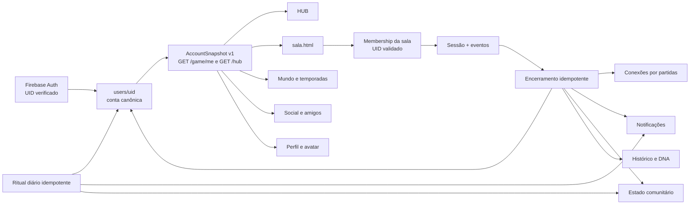

# Mapa de integração do ecossistema Sextolugar

Data do levantamento: 2026-08-15

## Objetivo

Uma pessoa autenticada deve conservar a mesma identidade, perfil, avatar,
progressão, carteira, relações, tarefas e histórico em qualquer experiência do
Sextolugar. Trocar de página, dispositivo ou sala não pode criar uma segunda
versão da conta.

O Firebase UID é a identidade canônica. IDs de participante continuam
existindo apenas para representar uma presença dentro de uma sala e podem ser
anônimos; eles não substituem uma conta.

## Visão de fluxo



## Contrato canônico de leitura

`AccountSnapshot v1` é a projeção compartilhada pelas interfaces. Campos
internos, licenças e dados privados não devem ser repassados sem necessidade.

```json
{
  "schemaVersion": 1,
  "uid": "firebase-uid",
  "profile": {
    "displayName": "Luis",
    "username": "luis",
    "email": "luis@example.com",
    "bio": "",
    "avatar": {
      "kind": "photo",
      "url": "https://...",
      "emoji": null,
      "color": "#342718"
    }
  },
  "progression": {
    "xp": 145,
    "level": 2,
    "title": "Iniciado",
    "levelXp": 50,
    "nextLevelXp": 200,
    "xpIntoLevel": 95,
    "xpNeededForLevel": 150,
    "progressPct": 63,
    "dailyStreak": 1,
    "achievementsCount": 0,
    "stats": { "gamesPlayed": 1, "wins": 0 }
  },
  "wallet": { "coins": 0 },
  "reputation": {
    "score": 0,
    "tier": "Iniciante",
    "totalSessions": 1,
    "totalReactions": 0,
    "topReactorCount": 0,
    "dailyRitualsCompleted": 0
  },
  "social": {
    "friendsCount": 0,
    "incomingCount": 0,
    "outgoingCount": 0
  },
  "activity": {
    "activeSession": null,
    "lastSession": null
  }
}
```

### Regra de nível

O nível não é persistido. Ele é sempre derivado do XP:

```text
level(xp) = floor(sqrt(max(0, xp) / 50)) + 1
xpForLevel(level) = (level - 1)² * 50
xpForNextLevel(level) = level² * 50
```

`reputation.tier` é uma classificação social diferente e não pode ser
apresentada como o nível numérico do jogador.

## Fontes de verdade e ownership

| Domínio | Fonte canônica | Escritor autorizado | Leitores |
|---|---|---|---|
| Identidade | Firebase Auth UID | Firebase Auth | todas as experiências |
| Perfil | `users/{uid}` | conta autenticada por API allowlist | HUB, sala, social, encontro |
| Avatar | `users/{uid}.avatar` + Storage | conta autenticada | todas as experiências |
| XP e nível | `users/{uid}.xp` | settlement/ledger backend | HUB, sala, ranking, decks |
| Moedas | `users/{uid}.coins` | transações backend | HUB, sala, loja |
| Reputação | `users/{uid}.reputation` | settlement backend | social, perfil, matchmaking |
| Sala | `salas/{roomId}` | host/membership validada | entrada, sala, painel |
| Sessão | `salas/{roomId}/sessions/{sessionId}` | motor backend | histórico, recap, mundo |
| Missão da sessão | `salas/{roomId}/missions/{participantId}` | host; conclusão pelo dono | sala, settlement |
| Amigos explícitos | arrays legados em `users` durante migração | API social | HUB, perfil, convites |
| Conexões por jogo | `social_connections/{uidA_uidB}` | settlement backend | sugestões, compatibilidade |
| Notificações | `users/{uid}/notifications/{id}` | serviços backend | HUB e central de avisos |
| Ritual diário | `daily_ritual/{date}` + `completions/{uid}` | API daily | HUB, mundo, reputação |
| Mundo | `world_state/current` | listeners/admin | HUB, sala, temporada |
| Descobertas | catálogo + `users/{uid}/discoveries` | API de claim | HUB, perfil |
| Foto de evento | `encontro_fotos/{eventId_uid}` | participante do evento | somente o evento |

## Eventos que conectam os domínios

| Evento | Origem | Consumidores esperados |
|---|---|---|
| `session.ended` | encerramento idempotente | XP, reputação, stats, social graph, conquistas, notificações, DNA, mundo, fragmentos |
| `live.daily_ritual_completed` | primeira conclusão diária do UID | reputação, notificação, mundo, fragmentos |
| `user.xp_awarded` | settlement/ledger | atualização em tempo real e conquistas |
| `user.achievement_unlocked` | motor de conquistas | notificação e perfil |
| amizade aceita | API social | notificação, presença e convites |

Todo comando econômico deve possuir uma chave idempotente. Exemplos:

```text
session:{sessionId}:user:{uid}:settlement:v1
daily:{YYYY-MM-DD}:user:{uid}
achievement:{achievementId}:user:{uid}
purchase:{paymentId}:user:{uid}
```

## Estado atual por experiência

| Experiência | Integração atual | Ação de convergência |
|---|---|---|
| `hub.html` | projeção `/hub`, mas continha nível e sugestões fixos | consumir `AccountSnapshot`, amigos, avatar, notificações e daily do servidor |
| `sala.html` | escuta `users/{uid}`; também usa caches globais | validar UID no roster e tratar cache apenas como aceleração por UID |
| `entrada.html` | cria/retoma sala e `activeSession` | usar o mesmo bootstrap de conta e membership |
| Deck Builder | lê XP e inventário; repete fórmula | consumir progressão canônica |
| Social/perfil | arrays de amigos e perfil Firestore | consolidar relações e avatar canônico |
| Encontro Marcado | perfil/foto paralelos | usar conta/avatar como default; manter foto de evento separada |
| Therapy | perfil paralelo por produto | referenciar UID e perfil público canônico; manter dados clínicos isolados |
| `jogo.html` legado | sessionStorage e PanelBridge antigo | redirecionar para motor atual ou aposentar |
| Painel | endpoint/configuração legados | usar backend Railway e dados canônicos |

## Compatibilidade durante a migração

Leituras de perfil aceitam temporariamente:

```text
avatar.url -> avatarPhotoUrl -> photoURL -> emoji/inicial
uid -> userId -> id do documento
memberSince -> createdAt
sessionCount -> sharedSessions (legado)
playedAt -> sessionAt (legado)
```

Escritas novas usam o schema v1 e mantêm os campos legados necessários até
que todos os clientes tenham migrado.

Caches locais (`osl_xp_cache`, `osl_coins`, `osl_avatar_photo`, nome e
customizações) nunca são autoridade. Eles só podem ser usados quando
`osl_cache_uid` corresponde ao Firebase UID restaurado e devem ser limpos ao
trocar de conta.

## Etapas de entrega

### Fundação

- `AccountSnapshot v1` em `/game/me` e dentro de `/hub`.
- HUB renderizando XP, nível, moedas, avatar, amigos e notificações reais.
- UID Firebase preservado e validado no roster da sessão.
- inicializadores de serviços isolados; uma falha não desliga os demais.
- encerramento de sessão e ritual diário idempotentes.
- missões da sala usando um caminho canônico.

### Autoridade econômica

- mover todas as concessões de XP/moedas do navegador para um ledger backend;
- aplicar multiplicadores de temporada/eventos no settlement;
- backfill de defaults e normalização dos documentos existentes.

### Social e tarefas

- migrar arrays de amizade e conexões para uma relação única;
- convites reais para sala e perfis clicáveis;
- modelo persistente de tarefas pessoais/coletivas com progresso e claim;
- central de notificações compartilhada.

### Mídia e experiências secundárias

- migrar Data URLs de avatar para Firebase Storage/CDN;
- usar o avatar canônico no Encontro e manter apenas fotos efêmeras por evento;
- vincular Therapy e outros produtos à identidade, preservando isolamento dos
  dados sensíveis;
- remover URLs Render e fluxos de jogo obsoletos.

## Critérios de aceitação ponta a ponta

1. Login -> HUB mostra o mesmo XP, nível, nome, avatar e moedas da sala.
2. Perfil alterado na sala reaparece no HUB após atualizar, sem usar dados da
   conta anterior.
3. Encerrar uma sessão atualiza uma única vez XP, stats, última sessão,
   conexões, mundo e notificações.
4. Repetir `end-game` ou `daily/complete` não duplica recompensa.
5. Dois jogadores autenticados na mesma sessão aparecem depois como conexão;
   amigos aceitos aparecem mesmo sem co-play.
6. Uma missão atribuída reaparece após reload e uma conclusão não é
   concedida novamente.
7. Trocar de conta no mesmo navegador não exibe nome, foto, XP ou moedas da
   conta anterior.
8. Falha em um subsistema opcional não impede social, reputação,
   notificações e mundo de inicializarem.
